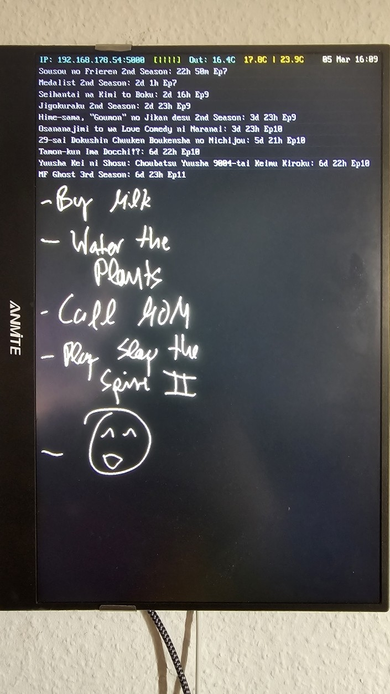

# PiNote

A lightweight C server that turns a Raspberry Pi with an LCD into a handwritten note display and dashboard. Notes are sent from an Android app over HTTP and rendered directly to the Linux framebuffer — no X11, no browser, no desktop environment needed.




## Features

- **Direct framebuffer rendering** — writes pixels to `/dev/fb0`, no display server overhead
- **Double-buffered** — flicker-free screen updates via back buffer + single memcpy flip
- **Status bar** — shows IP address, WiFi signal, outside temperature, and current time
- **Outside weather** — current temperature via [Open-Meteo](https://open-meteo.com/) (free, no API key)
- **Philips Hue integration** — displays temperature from one or more Hue sensors
- **AniList integration** — shows countdown to next episode of tracked anime
- **Auto-scaling notes** — notes shrink automatically when the screen fills up, no notes are ever deleted
- **Persistent notes** — notes survive reboots, saved to disk on every change
- **Orientation support** — landscape, portrait, and flipped variants
- **Embedded bitmap font** — 8x16 CP437-style font, no external font files needed
- **Configurable** — all settings in a single JSON config file

## Requirements

- Raspberry Pi (tested on Pi Zero W 2) running Linux
- LCD connected via HDMI with framebuffer at `/dev/fb0`
- GCC and pthreads

## Building

```bash
gcc -O2 -o notes_server notes_server.c -lpthread
```

## Running

```bash
sudo ./notes_server
```

Root access is required for framebuffer access. To run as a systemd service:

```ini
# /etc/systemd/system/pinote.service
[Unit]
Description=PiNote Server
After=network.target

[Service]
ExecStart=/home/pi/notes_server
WorkingDirectory=/home/pi
Restart=always
User=root

[Install]
WantedBy=multi-user.target
```

```bash
sudo systemctl enable pinote
sudo systemctl start pinote
```

## Configuration

Create a `pinote_config.json` in the same directory as the server:

```json
{
  "latitude": 52.52,
  "longitude": 13.405,
  "hue_bridge_ip": "192.168.1.100",
  "hue_api_key": "your-hue-api-key",
  "hue_sensor_ids": ["1", "2"],
  "anilist_media_ids": [182255, 185753],
  "truncate_titles": false,
  "anime_per_line": 1,
  "note_scale": 0.45
}
```

| Field | Type | Default | Description |
|-------|------|---------|-------------|
| `latitude` | float | — | Latitude for outside temperature (Open-Meteo) |
| `longitude` | float | — | Longitude for outside temperature (Open-Meteo) |
| `hue_bridge_ip` | string | — | IP address of your Philips Hue Bridge |
| `hue_api_key` | string | — | Hue Bridge API key ([how to get one](https://developers.meethue.com/develop/get-started-2/)) |
| `hue_sensor_ids` | string[] | — | Sensor IDs to read temperature from (pipe-separated on display) |
| `anilist_media_ids` | int[] | — | [AniList](https://anilist.co) media IDs to track |
| `truncate_titles` | bool | `false` | Truncate long anime titles |
| `anime_per_line` | int | `0` | Anime entries per status bar row (0 = all on one line) |
| `note_scale` | float | `0.45` | Note rendering scale (0.1–1.0). Notes auto-shrink below this when the screen fills up |

All fields are optional. The server runs fine without a config file — you just won't get Hue/AniList info in the status bar.

## API

The server listens on port **5000**.

### `POST /receive_note`

Send a handwritten note:

```json
{
  "timestamp": 1700000000000,
  "width": 300.0,
  "height": 150.0,
  "strokes": [
    {
      "points": [
        {"x": 0.0, "y": 0.0},
        {"x": 10.5, "y": 20.3}
      ]
    }
  ]
}
```

### `POST /receive_note` (line break)

Insert a line break in the note layout:

```json
{
  "linebreak": true,
  "strokes": [],
  "width": 0,
  "height": 0
}
```

### `POST /clear_notes`

Clear all notes from the screen and disk.

## Display orientation

The display orientation is set via `FORCE_ORIENTATION` in the source code:

| Value | Orientation |
|-------|-------------|
| `0` | Auto-detect |
| `1` | Landscape (0°) |
| `2` | Portrait (90°) |
| `3` | Landscape flipped (180°) |
| `4` | Portrait flipped (270°) |

## LCD resolution fix

If your LCD resolution gets messed up after power cycling the display (common with KMS driver), add this to `/boot/firmware/cmdline.txt`:

```
video=HDMI-A-1:1920x1200@60D
```

Replace `1920x1200` with your LCD's native resolution.

## Architecture

```
Android App ──HTTP POST──► PiNote Server ──mmap──► /dev/fb0 ──► LCD
                                │
                          ┌─────┴─────┐
                          │ Back      │
                          │ Buffer    │──memcpy flip──► Framebuffer
                          └───────────┘
                                │
                    ┌───────────┼───────────┐
                    ▼           ▼           ▼
               Note Store   Status Bar      Config
               (disk +      (IP, weather,   (JSON
                memory)      Hue, Anime)     file)
```

## License

MIT
