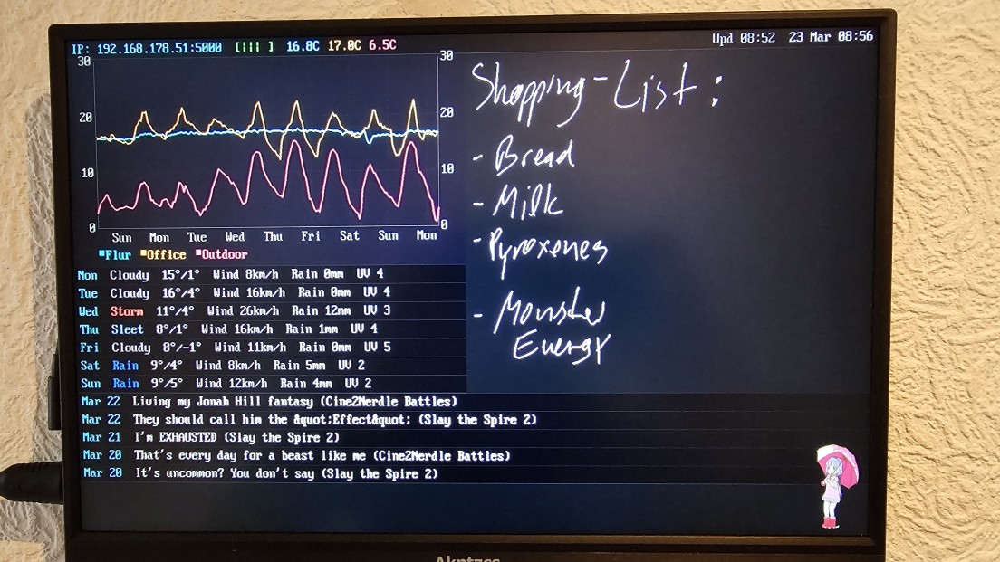

# PiNote

A lightweight C server that turns a Raspberry Pi with an LCD into a handwritten note display and dashboard. Notes are sent from an Android app over HTTP and rendered directly to the Linux framebuffer — no X11, no browser, no desktop environment needed.




## Features

- **Direct framebuffer rendering** — writes pixels to `/dev/fb0`, no display server overhead
- **Double-buffered** — flicker-free screen updates via back buffer + single memcpy flip
- **Module layout system** — configurable dashboard modules (anime, chart, RSS, notes) placed via JSON config as full or half width
- **Data chart** — line chart with auto-scaled axes, color-coded lines, and legend. Feeds from any JSON API returning time-series data (e.g. temperature sensors)
- **RSS feed** — displays headlines from any RSS feed (direct XML or rss2json fallback for Cloudflare-protected sites)
- **Status bar** — IP address, WiFi signal, sensor temperatures (color-matched to chart), last updated timestamp, and clock
- **Outside weather** — current temperature via [Open-Meteo](https://open-meteo.com/) (free, no API key)
- **Animated sprite overlay** — animated pixel art character drawn to front buffer at configurable FPS, with fuzzy transparency keying
- **Philips Hue integration** — displays temperature from one or more Hue sensors, colors match chart legend
- **AniList integration** — countdown to next episode of tracked anime, with urgency-colored countdowns. Finished anime are automatically hidden
- **Auto-scaling notes** — notes shrink automatically when the screen fills up
- **Persistent notes** — notes survive reboots, saved to disk on every change
- **Orientation support** — landscape, portrait, and flipped variants
- **Embedded bitmap font** — 8x16 CP437-style font, no external font files needed

## Requirements

- Raspberry Pi (tested on Pi Zero W 2) running Linux
- LCD connected via HDMI with framebuffer at `/dev/fb0`
- GCC and pthreads

## Building

```bash
make
```

Or manually:

```bash
gcc -Wall -Wextra -O2 -o notes_server notes_server.c fb_draw.c config.c api_fetch.c chart.c rss.c sprite.c -lpthread -lm
```

## Project Structure

```
pinote.h         Shared types, defines, extern globals, function declarations
fb_draw.c        Framebuffer init, pixels, lines, font data, text rendering
config.c         JSON config file parsing
api_fetch.c      API fetchers (Hue, Open-Meteo, chart data, AniList, RSS)
chart.c          Data chart rendering (auto-scaled axes, multi-line, legend)
rss.c            RSS feed module rendering
sprite.c         Animated sprite overlay (front buffer, fuzzy transparency)
notes_server.c   Main, HTTP server, notes, status bar, layout manager
sprite_data.h    Auto-generated sprite pixel data (from convert_sprite)
convert_sprite.c Offline tool: BMP sprite sheet → C header array
Makefile         Build script
```

## Running

```bash
sudo ./notes_server
```

Root access is required for framebuffer access. To run as a systemd service:

```ini
# /etc/systemd/system/pinote.service
[Unit]
Description=PiNote Server
After=network.target

[Service]
ExecStart=/home/pi/notes_server
WorkingDirectory=/home/pi
Restart=always
User=root

[Install]
WantedBy=multi-user.target
```

```bash
sudo systemctl enable pinote
sudo systemctl start pinote
```

## Configuration

Create a `pinote_config.json` in the same directory as the server:

```json
{
  "latitude": 52.52,
  "longitude": 13.405,
  "hue_bridge_ip": "192.168.1.100",
  "hue_api_key": "your-hue-api-key",
  "hue_sensor_ids": ["1", "2"],
  "anilist_media_ids": [182255, 185753],
  "anime_truncate": 20,
  "anime_per_line": 2,
  "note_scale": 0.6,
  "chart_api_url": "https://example.com/api/temperatures",
  "chart_api_key": "your-api-key",
  "chart_height": 200,
  "refresh_interval": 1800,
  "rss_url": "https://example.com/rss",
  "max_rss_items": 6,
  "rss_truncate": 30,
  "rss_per_line": 1,
  "modules": [
    {"type": "anime", "width": "full"},
    {"type": "rss", "width": "full"},
    {"type": "chart", "width": "half"},
    {"type": "notes", "width": "half"}
  ]
}
```

| Field | Type | Default | Description |
|-------|------|---------|-------------|
| `latitude` | float | — | Latitude for outside temperature (Open-Meteo) |
| `longitude` | float | — | Longitude for outside temperature (Open-Meteo) |
| `hue_bridge_ip` | string | — | IP address of your Philips Hue Bridge |
| `hue_api_key` | string | — | Hue Bridge API key ([how to get one](https://developers.meethue.com/develop/get-started-2/)) |
| `hue_sensor_ids` | string[] | — | Sensor IDs to read temperature from |
| `anilist_media_ids` | int[] | — | [AniList](https://anilist.co) media IDs to track |
| `anime_truncate` | int | `0` | Max characters for anime titles (0 = no truncation) |
| `anime_per_line` | int | `2` | Anime entries per row (1 or 2) |
| `note_scale` | float | `0.6` | Note rendering scale (0.1-1.0). Notes auto-shrink below this when the screen fills up |
| `chart_api_url` | string | — | URL to fetch chart data from (see format below) |
| `chart_api_key` | string | — | API key sent as `X-API-Key` header |
| `chart_height` | int | `200` | Chart height in pixels. Set to `0` to disable |
| `orientation` | int | `1` | Display orientation: 1=landscape, 2=portrait, 3=landscape flipped, 4=portrait flipped |
| `sprite_enabled` | int | `0` | Set to `1` to show animated sprite overlay |
| `refresh_interval` | int | `300` | How often to refresh API data in seconds (minimum 30) |
| `rss_url` | string | — | RSS feed URL |
| `max_rss_items` | int | `6` | Max RSS items to display (max 10) |
| `rss_truncate` | int | `0` | Max characters for RSS titles (0 = no truncation) |
| `rss_per_line` | int | `1` | RSS items per row (1 or 2) |
| `modules` | array | see below | Module layout configuration |

All fields are optional. The server runs fine without a config file — you just won't get any dashboard data.

### Modules

The `modules` array controls which dashboard modules are shown and how they're laid out. Each entry has a `type` and `width`:

| Type | Description |
|------|-------------|
| `"anime"` | AniList anime countdowns |
| `"chart"` | Data line chart |
| `"rss"` | RSS feed headlines |
| `"notes"` | Handwritten notes area |

| Width | Description |
|-------|-------------|
| `"full"` | Takes the full screen width (own row) |
| `"half"` | Paired side-by-side with the next half-width module |

Each module entry can also have an optional `"span"` field (default 1). A half-width module with `"span": 2` takes one side of the screen and spans the combined height of 2 other half-width modules stacked on the opposite side.

Half-width modules are grouped automatically. Modules with `span >= 2` claim their partners first, then remaining halves pair 1:1. The side each module appears on follows config order: if the spanning module comes after its first partner, it goes on the right. Full-width modules between halves render in their own rows. If a half-width module has no partner, it renders on the left side only.

When a fixed-height module (e.g. chart) is paired with a flexible one (e.g. notes), the row uses the fixed module's height. For span groups, the stacked modules' heights sum up to determine the total group height.

Default layout if `modules` is not specified:
```json
[
  {"type": "anime", "width": "full"},
  {"type": "chart", "width": "full"},
  {"type": "notes", "width": "full"}
]
```

The status bar is always at the top and is not part of the module system.

### Chart data API format

The `chart_api_url` endpoint should return a flat JSON array of time-series readings:

```json
[
  {"time": "2024-01-15 12:00:00", "sensor_name": "Office", "temperature_c": "22.5"},
  {"time": "2024-01-15 12:00:00", "sensor_name": "Outdoor", "temperature_c": "8.3"}
]
```

Readings are grouped by `sensor_name` and plotted as separate color-coded lines. Data should be ordered newest-first (the server sorts it). Lines are sorted alphabetically and assigned colors: cyan, yellow, red, teal, purple.

### Sprite animation

The server can display an animated sprite overlay (e.g. a dancing pixel art character). To set up:

1. Create a horizontal BMP sprite sheet (24bpp, all frames same size, magenta `#FF00FF` background)
2. Compile the converter: `gcc -o convert_sprite convert_sprite.c`
3. Generate the header: `./convert_sprite spritesheet.bmp <num_frames>`
4. This creates `sprite_data.h` — rebuild the server with `make clean && make`
5. Set `"sprite_enabled": 1` in your config

The sprite renders at `SPRITE_FPS` (default 10, set in `pinote.h`) in the bottom-right corner. Transparency uses fuzzy hue-based matching to handle compression artifacts from video-sourced sprite sheets. CPU overhead is negligible even on a Pi Zero W 2.

## Display Layout

Default (all full-width):

```
+--------------------------------------+
| Status bar (IP, WiFi, temps, clock)  |
+--------------------------------------+
| Anime countdowns                     |
+--------------------------------------+
| Data chart                           |
+--------------------------------------+
| Notes area                           |
+--------------------------------------+
```

With half-width modules (adjacent):

```json
"modules": [
  {"type": "anime", "width": "full"},
  {"type": "rss", "width": "full"},
  {"type": "chart", "width": "half"},
  {"type": "notes", "width": "half"}
]
```
```
+--------------------------------------+
| Status bar                           |
+--------------------------------------+
| Anime countdowns                     |
+--------------------------------------+
| RSS headlines                        |
+------------------+-------------------+
| Chart            | Notes             |
+------------------+-------------------+
```

With half-width modules (non-adjacent, full-width modules render first):

```json
"modules": [
  {"type": "chart", "width": "half"},
  {"type": "anime", "width": "full"},
  {"type": "rss", "width": "full"},
  {"type": "notes", "width": "half"}
]
```
```
+--------------------------------------+
| Status bar                           |
+------------------+-------------------+
| Chart            | Notes             |
+------------------+-------------------+
| Anime countdowns                     |
+--------------------------------------+
| RSS headlines                        |
+--------------------------------------+
```

With span (one module spanning multiple rows):

```json
"modules": [
  {"type": "chart", "width": "half"},
  {"type": "notes", "width": "half", "span": 2},
  {"type": "anime", "width": "half"},
  {"type": "rss", "width": "full"}
]
```
```
+--------------------------------------+
| Status bar                           |
+------------------+-------------------+
| Chart            | Notes             |
+------------------+   (span 2)       |
| Anime            |                   |
+------------------+-------------------+
| RSS headlines                        |
+--------------------------------------+
```

## API

The server listens on port **5000**.

### `POST /receive_note`

Send a handwritten note:

```json
{
  "timestamp": 1700000000000,
  "width": 300.0,
  "height": 150.0,
  "strokes": [
    {
      "points": [
        {"x": 0.0, "y": 0.0},
        {"x": 10.5, "y": 20.3}
      ]
    }
  ]
}
```

### `POST /receive_note` (line break)

Insert a line break in the note layout:

```json
{
  "linebreak": true,
  "strokes": [],
  "width": 0,
  "height": 0
}
```

### `POST /clear_notes`

Clear all notes from the screen and disk.

## Display orientation

The display orientation is set via `"orientation"` in `pinote_config.json`:

| Value | Orientation |
|-------|-------------|
| `1` | Landscape (0°) |
| `2` | Portrait (90°) |
| `3` | Landscape flipped (180°) |
| `4` | Portrait flipped (270°) |

Defaults to landscape if not set.

## Hiding the console cursor

If a blinking cursor appears on the LCD, add this to `/boot/firmware/cmdline.txt`:

```
vt.global_cursor_default=0
```

You may also want to add `quiet` and remove `console=serial0,115200` from the same line to suppress boot messages.

## LCD resolution fix

If your LCD resolution gets messed up after power cycling the display (common with KMS driver), add this to `/boot/firmware/cmdline.txt`:

```
video=HDMI-A-1:1920x1200@60D
```

Replace `1920x1200` with your LCD's native resolution.

## Architecture

```
Android App --HTTP POST--> PiNote Server --mmap--> /dev/fb0 --> LCD
                                |
                          +-----+-----+
                          | Back      |
                          | Buffer    |--memcpy flip--> Framebuffer
                          +-----------+                     ^
                                |                           |
                    +-----------+-----------+          Sprite Thread
                    v           v           v        (front buffer,
               Note Store   Status Bar    APIs        fuzzy keying)
               (disk +      (IP, WiFi,   (Hue, Weather, AniList,
                memory)      clock)       Chart data, RSS)
                                            |
                              +------+------+------+
                              v      v      v      v
                           Anime   Chart   RSS   Notes
                          (module) (module) (module) (module)
```

## License

MIT
